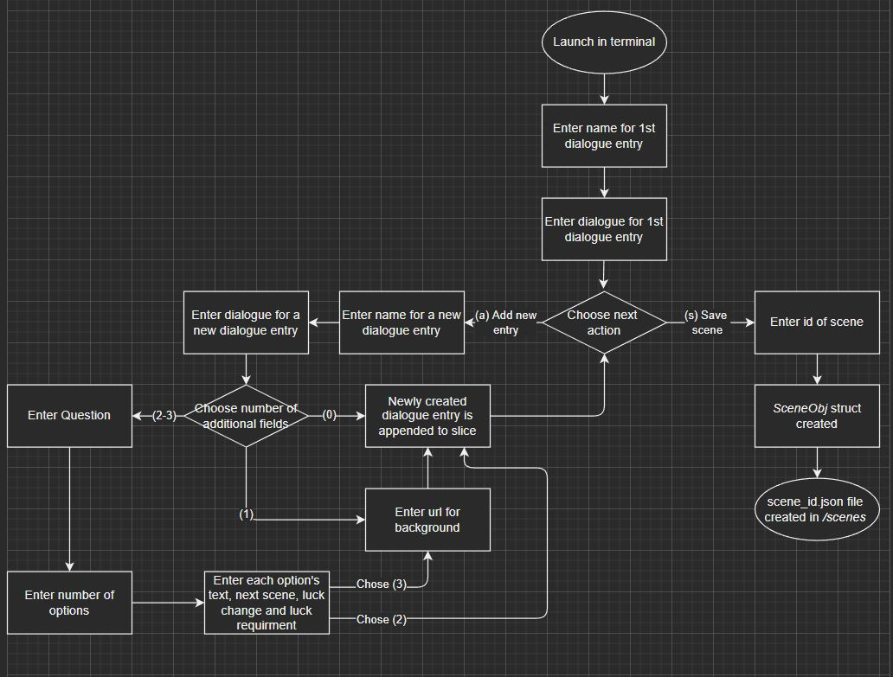

# CLI-VN-Dialogue-File-Maker

## Overview

This CLI tool is used to write dialogue for "planned-vn-style-game" !
bills.go & billsLogic.go were created using the Go tutorial series by TheNetNinja, found [here.](https://www.youtube.com/playlist?list=PL4cUxeGkcC9gC88BEo9czgyS72A3doDeM)
Afterwards, inspired by this, I created my own version in order to make json files of dialogue.

## Detail

NOTE: int is used (strconv.Atoi(string)) instead of int64; this may change 

Instead of making methods which directly mutate the struct variable that they're called on, as in the bills CLI tutorial, I instead took the approach of making normal functions, which took in (copy of) a struct variable, prompted users for content to put into the fields of that struct, then prompted users if they wanted to add additional entries, of that struct type (into a slice). 

<details>
<summary><h2>User Flow diagram</h2></summary>



</details>

## Usage

To launch, type into the terminal:

```bash
clear ; go run dialogue.go dialogueTypes.go
```
Then, enter the name and dialogue for the first entry. 

After doing this, there is a prompt, asking if the user wishes to create more entries, and as before, prompts for name and dialogue fields.

When the user has finished the last entry of the slice, they can may enter _"s"_ at the next prompt (instead of _"a"_), which returns the final version of that copy of the struct variable.

Lastly, the user is prompted to enter an id for that scene (corresponding to which choice made at the end of the previous scene should lead to this new scene) and then the whole scene is _marshalled_ into JSON format, and outputted as a file with a name of *"scene_id.json"* into the _scenes_ folder.
